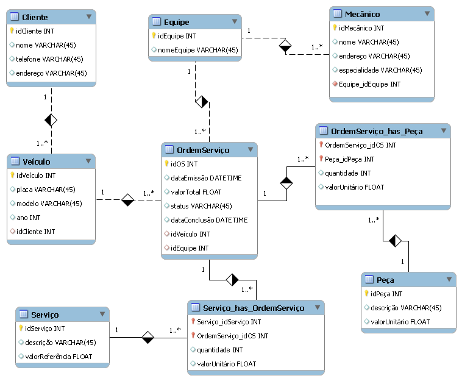

# Sistema de Gestão de Oficina Mecânica

## 📖 Descrição do Projeto
Este projeto tem como objetivo modelar, de forma conceitual, um **Sistema de Gestão para Oficinas Mecânicas**, abrangendo o cadastro de clientes, veículos, equipes, mecânicos, serviços, peças e o gerenciamento de ordens de serviço.

O modelo foi elaborado seguindo as práticas de **Engenharia de Requisitos** e **Modelagem Conceitual** para bancos de dados relacionais, representado por um **Diagrama EER (Enhanced Entity-Relationship)**.

---

## 🎯 Objetivos do Sistema
- Registrar clientes e seus veículos.
- Controlar ordens de serviço emitidas pela oficina.
- Associar equipes e mecânicos às ordens de serviço.
- Gerenciar serviços e peças utilizadas em cada ordem.
- Calcular valores totais com base nos itens aplicados.

---

## 🏗 Estrutura Conceitual

### Entidades Principais
- **Cliente**: Armazena informações de identificação e contato.
- **Veículo**: Associado a um cliente, com dados como placa, modelo e ano.
- **Equipe**: Conjunto de mecânicos responsável pela execução de serviços.
- **Mecânico**: Profissional vinculado a uma equipe, com especialidade definida.
- **Ordem de Serviço (OS)**: Documento que consolida serviços e peças aplicadas.
- **Serviço**: Atividade executada na OS, com valor de referência.
- **Peça**: Item físico utilizado, com valor unitário.

### Relacionamentos
- Um cliente **possui** um ou mais veículos.
- Cada veículo **pode ter** várias ordens de serviço.
- Uma ordem de serviço é **executada por** uma equipe.
- Uma equipe é formada por **um ou mais mecânicos**.
- Uma ordem de serviço **inclui** um ou mais serviços e peças.
- Quantidade e valor unitário de serviços e peças são registrados nas tabelas associativas.

---

## 🔗 Cardinalidades
- **Cliente → Veículo**: 1:N  
- **Veículo → Ordem de Serviço**: 1:N  
- **Equipe → Ordem de Serviço**: 1:N  
- **Equipe → Mecânico**: 1:N  
- **Ordem de Serviço → Serviço**: N:M (via `Servico_has_OrdemServico`)  
- **Ordem de Serviço → Peça**: N:M (via `OrdemServico_has_Peca`)  

---

## 📊 Campos e Atributos de Destaque
- **Chaves Primárias** (`idCliente`, `idVeiculo`, `idEquipe`, etc.)
- **Chaves Estrangeiras** para ligação entre tabelas.
- Campos para valores monetários (`valorTotal`, `valorUnitário`, `valorReferência`).
- Datas de emissão e conclusão da OS.
- Status da OS para controle do fluxo de trabalho.

---

## 🛠 Tecnologias e Ferramentas
- **Modelagem**: MySQL Workbench (Diagrama EER).
- **Banco de Dados**: MySQL.

---

## 📌 Possíveis Expansões
- Cadastro de fornecedores de peças.
- Histórico detalhado de manutenção.
- Relatórios financeiros e operacionais.
- Integração com sistemas de agendamento.

---

## 📷 Diagrama EER
O diagrama abaixo representa a estrutura conceitual do banco de dados:

  

---

## 📜 Licença
Este projeto é de uso acadêmico/didático.  
Sinta-se livre para adaptar e expandir conforme suas necessidades.
